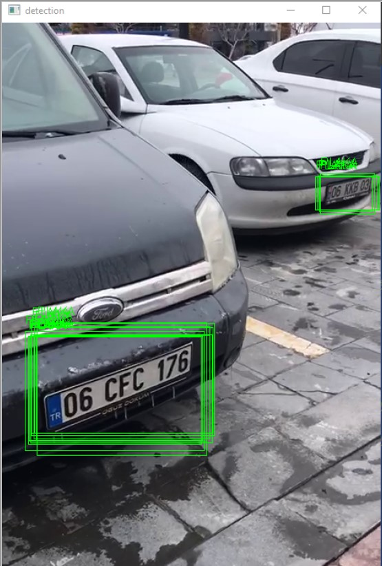

# DEEP LEARNING-LicensePlateDetection

# DEEP LEARNING - OBJECT DETECTION PROJECT

Derin Öğrenme-Görüntü İşleme-YOLOv4-Plaka Tespit

## Bitirme projesi.
 Yolov4 ile nesne tespiti yapılmıştır. Dataset toplanıp google colabrotary üzerinde model eğitimi yapılmıştır. 500 fotoğraf eğitim için 100 fotoğraf test için ayrılmıştır. Model elde edilmiş. Model koda aktarılıp örnek bir videoda test edilmiştir.

 

